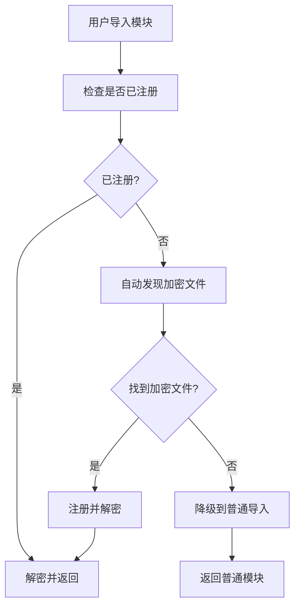

# 架构设计文档

## 🏗️ 系统架构

### 设计原则

本框架遵循 **Linux 内核的设计哲学**：

1. **模块化**: 每个组件职责单一，边界清晰
2. **分层设计**: 核心层、服务层、接口层分离
3. **可插拔**: 组件可以独立替换和扩展
4. **错误处理**: 优雅的错误处理和恢复机制
5. **性能优先**: 最小化运行时开销
6. **自动化**: 零配置，智能发现和配置

### 整体架构图

```
┌─────────────────────────────────────────────────────────────┐
│                    用户接口层 (Interface Layer)              │
├─────────────────────────────────────────────────────────────┤
│  CLI工具        │  Python API      │  入口点文件            │
│  deepenc build  │  deepenc.bootstrap()  │  main.py/grpc_main.py │
└─────────────────────────────────────────────────────────────┘
┌─────────────────────────────────────────────────────────────┐
│                    服务层 (Service Layer)                   │
├─────────────────────────────────────────────────────────────┤
│  构建服务        │  发现服务        │  加载服务              │
│  ProjectBuilder │  FileScanner     │  ModuleLoader         │
│  Packager       │  FileFilter      │  ONNXLoader           │
└─────────────────────────────────────────────────────────────┘
┌─────────────────────────────────────────────────────────────┐
│                    核心层 (Core Layer)                      │
├─────────────────────────────────────────────────────────────┤
│  加密引擎        │  授权管理        │  错误处理              │
│  AESCrypto      │  AuthManager     │  Exception Classes    │
│  HardwareAuth   │  LicenseManager  │  Error Codes          │
└─────────────────────────────────────────────────────────────┘
┌─────────────────────────────────────────────────────────────┐
│                    启动层 (Bootstrap Layer)                 │
├─────────────────────────────────────────────────────────────┤
│  系统启动器      │  自动配置        │  生命周期管理          │
│  bootstrap()    │  auto_initialize() │  shutdown()          │
│  quick_start()  │  配置发现        │  状态管理             │
└─────────────────────────────────────────────────────────────┘
```

## 🔧 核心组件

### 1. 系统启动器 (bootstrap.py)

```python
class EncryptionSystem:
    """加密系统
    
    统一管理加密模块和模型的加载。
    提供自动初始化、配置发现和生命周期管理。
    """
    
    def __init__(self):
        self.module_manager = ModuleLoaderManager()
        self.onnx_manager = ONNXLoaderManager()
        self._is_initialized = False
        self._initialization_error = None
    
    def initialize(self, module_config=None):
        """初始化加密系统
        
        支持自动配置发现和手动配置两种模式。
        """
```

**设计考虑:**
- **自动发现**: 自动查找配置文件，支持多种路径
- **降级机制**: 配置失败时自动降级到默认模式
- **生命周期管理**: 提供完整的启动、运行、关闭流程

### 2. 加密引擎 (core/crypto.py)

```python
class AESCrypto:
    """AES-CFB 加密引擎
    
    特点:
    - 固定 IV，保持与原项目兼容
    - 部分加密，优化大文件性能
    - 严格的错误处理
    """
```

**设计考虑:**
- **兼容性**: 与原项目的加密方式完全兼容
- **性能**: 只加密文件前 10MB，大大提高性能
- **安全性**: 使用 AES-CFB 模式，平衡安全性和性能

### 3. 授权管理 (core/auth.py)

```python
class AuthManager:
    """统一授权管理
    
    密钥获取优先级:
    1. 硬件授权许可证
    2. 文件许可证  
    3. 环境变量
    """
```

**设计考虑:**
- **降级机制**: 硬件授权不可用时自动降级
- **多源支持**: 支持多种密钥来源
- **缓存机制**: 避免重复的授权检查

### 4. 智能加载器 (loaders/)

```python
class ModuleLoaderManager:
    """模块加载器管理器
    
    功能:
    - 自动发现加密模块
    - 智能缓存管理
    - 透明导入支持
    """

class ONNXLoaderManager:
    """ONNX 模型加载器管理器
    
    功能:
    - 自动解密模型文件
    - 临时文件管理
    - 内存优化
    """
```

**设计考虑:**
- **透明性**: 完全兼容标准的 import 语句
- **自动发现**: 无需配置，自动发现加密文件
- **性能缓存**: 解密后的内容智能缓存

## 🔄 工作流程

### 系统启动流程

```mermaid
graph TD
    A[用户调用 deepenc.bootstrap()] --> B[创建 EncryptionSystem]
    B --> C[初始化 ONNX 加载器]
    C --> D[初始化模块加载器]
    D --> E[安装导入钩子]
    E --> F[系统就绪]
    
    G[用户调用 deepenc.auto_initialize()] --> H[查找配置文件]
    H --> I{找到配置?}
    I -->|是| J[使用配置初始化]
    I -->|否| K[使用默认配置]
    J --> F
    K --> F
```

### 自动初始化流程

```mermaid
graph TD
    A[auto_initialize()] --> B[查找配置文件]
    B --> C[config/encryption_config.json]
    C --> D[build/config/encryption_config.json]
    D --> E[项目根目录配置文件]
    E --> F{找到配置?}
    F -->|是| G[加载配置]
    F -->|否| H[使用默认配置]
    G --> I[初始化系统]
    H --> I
    I --> J[返回系统实例]
```

### 模块导入流程



## 🏗️ 构建系统

### ProjectBuilder 架构

```python
class ProjectBuilder:
    """简化的项目构建器
    
    核心功能:
    1. 复制整个项目到build目录
    2. 加密ONNX模型和Python文件
    3. 支持排除特定目录和文件
    4. 不生成配置文件，依赖用户自定义loader
    """
```

**设计特点:**
- **简化流程**: 专注于核心构建功能
- **灵活配置**: 支持自定义过滤规则
- **智能排除**: 自动排除测试、文档等非核心文件

### 文件发现系统

```python
class FileScanner:
    """文件扫描器
    
    功能:
    - 自动发现 Python 文件
    - 自动发现 ONNX 模型
    - 支持自定义过滤规则
    """

class FileFilter:
    """文件过滤器
    
    支持:
    - 目录级排除
    - 文件级排除
    - 强制包含特定文件
    """
```

## 🔐 安全设计

### 加密策略

1. **选择性加密**: 只加密核心业务逻辑，不加密配置和测试
2. **部分加密**: 大文件只加密前 10MB，平衡安全性和性能
3. **密钥管理**: 支持多种密钥来源，自动降级机制

### 授权机制

1. **硬件授权**: 生产环境推荐，最高安全性
2. **许可证文件**: 中等安全性，适合企业部署
3. **环境变量**: 开发环境使用，最低安全性

## 📊 性能优化

### 缓存策略

1. **模块缓存**: 解密后的模块内容缓存
2. **模型缓存**: 解密后的模型文件缓存
3. **配置缓存**: 授权和配置信息缓存

### 内存管理

1. **临时文件**: 大文件解密使用临时文件
2. **流式处理**: 支持流式加密/解密
3. **垃圾回收**: 及时清理临时文件和缓存

## 🔧 扩展性设计

### 插件系统

```python
# 支持自定义加密算法
class CustomCrypto:
    def encrypt(self, data, key):
        # 自定义加密逻辑
        pass
    
    def decrypt(self, data, key):
        # 自定义解密逻辑
        pass

# 支持自定义文件过滤器
class CustomFilter:
    def should_include(self, file_path):
        # 自定义过滤逻辑
        pass
```

### 配置扩展

```python
# 支持多种配置文件格式
config_loaders = {
    '.json': JSONConfigLoader,
    '.yaml': YAMLConfigLoader,
    '.toml': TOMLConfigLoader
}

# 支持环境特定的配置
env_configs = {
    'development': 'dev_config.json',
    'production': 'prod_config.json',
    'testing': 'test_config.json'
}
```

## 🚀 部署架构

### 开发环境

```
项目目录/
├── src/                    # 源码（未加密）
├── model/                  # 模型（未加密）
├── tests/                  # 测试代码
└── requirements.txt        # 依赖
```

### 生产环境

```
构建目录/
├── main.py                 # 入口文件（未加密）
├── encrypted/              # 加密文件
│   ├── python/            # 加密的 Python 文件
│   └── models/            # 加密的模型文件
├── config/                 # 加密配置
└── conf/                   # 运行时配置
```

### 容器化部署

```dockerfile
FROM python:3.9-slim

# 安装依赖
RUN pip install deepenc onnxruntime

# 复制加密项目
COPY build/ /app/
WORKDIR /app

# 设置环境变量
ENV ENCRYPTION_KEY=your-production-key

# 启动应用
CMD ["python", "main.py"]
```

## 📈 监控和调试

### 系统状态监控

```python
# 获取系统状态
system = deepenc.get_system()
if system:
    status = system.get_status()
    print(f"模块加载器: {status['module_loader']}")
    print(f"ONNX加载器: {status['onnx_loader']}")
    print(f"授权状态: {status['auth_status']}")
```

### 性能监控

```python
# 获取性能统计
perf_stats = system.get_performance_stats()
print(f"解密操作数: {perf_stats['decrypt_count']}")
print(f"缓存命中率: {perf_stats['cache_hit_rate']:.2%}")
print(f"平均解密时间: {perf_stats['avg_decrypt_time']:.2f}ms")
```

### 调试模式

```python
# 启用调试日志
import logging
logging.basicConfig(level=logging.DEBUG)

# 启用详细输出
system = deepenc.bootstrap()
system.enable_debug_mode()
```

## 🔮 未来规划

### 短期目标

1. **性能优化**: 进一步提升解密性能
2. **缓存优化**: 智能缓存策略
3. **错误处理**: 更友好的错误信息

### 长期目标

1. **分布式支持**: 支持分布式部署
2. **云原生**: 支持 Kubernetes 等云平台
3. **AI 增强**: 智能配置推荐和优化
