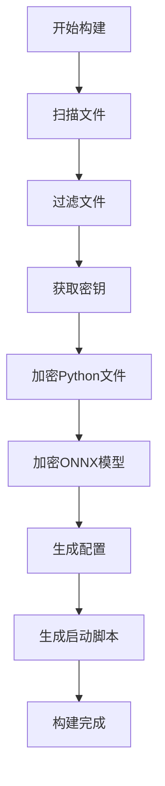
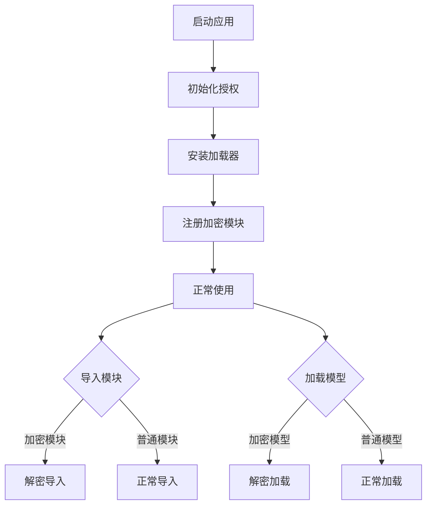
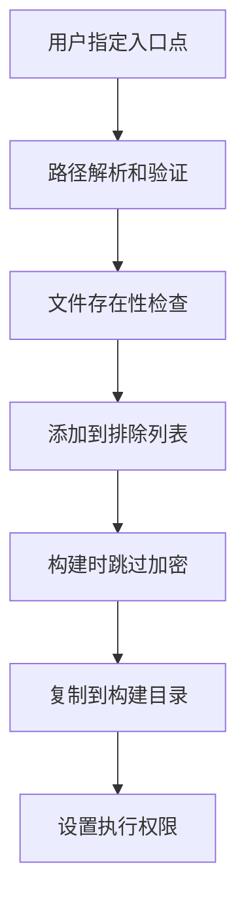

# 架构设计文档

## 🏗️ 系统架构

### 设计原则

本框架遵循 **Linux 内核的设计哲学**：

1. **模块化**: 每个组件职责单一，边界清晰
2. **分层设计**: 核心层、服务层、接口层分离
3. **可插拔**: 组件可以独立替换和扩展
4. **错误处理**: 优雅的错误处理和恢复机制
5. **性能优先**: 最小化运行时开销

### 整体架构图

```
┌─────────────────────────────────────────────────────────────┐
│                    用户接口层 (Interface Layer)              │
├─────────────────────────────────────────────────────────────┤
│  CLI工具        │  Python API      │  入口点文件            │
│  deepenc build  │  deepenc.init()  │  main.py/grpc_main.py │
└─────────────────────────────────────────────────────────────┘
┌─────────────────────────────────────────────────────────────┐
│                    服务层 (Service Layer)                   │
├─────────────────────────────────────────────────────────────┤
│  构建服务        │  发现服务        │  加载服务              │
│  ProjectBuilder │  FileScanner     │  ModuleLoader         │
│  Packager       │  FileFilter      │  ONNXLoader           │
└─────────────────────────────────────────────────────────────┘
┌─────────────────────────────────────────────────────────────┐
│                    核心层 (Core Layer)                      │
├─────────────────────────────────────────────────────────────┤
│  加密引擎        │  授权管理        │  错误处理              │
│  AESCrypto      │  AuthManager     │  Exception Classes    │
│  HardwareAuth   │  LicenseManager  │  Error Codes          │
└─────────────────────────────────────────────────────────────┘
```

## 🔧 核心组件

### 1. 加密引擎 (core/crypto.py)

```python
class AESCrypto:
    """AES-CFB 加密引擎
    
    特点:
    - 固定 IV，保持与原项目兼容
    - 部分加密，优化大文件性能
    - 严格的错误处理
    """
```

**设计考虑:**
- **兼容性**: 与原项目的加密方式完全兼容
- **性能**: 只加密文件前 10MB，大大提高性能
- **安全性**: 使用 AES-CFB 模式，平衡安全性和性能

### 2. 授权管理 (core/auth.py)

```python
class AuthManager:
    """统一授权管理
    
    密钥获取优先级:
    1. 硬件授权许可证
    2. 文件许可证  
    3. 环境变量
    """
```

**设计考虑:**
- **降级机制**: 硬件授权不可用时自动降级
- **多源支持**: 支持多种密钥来源
- **缓存机制**: 避免重复的授权检查

### 3. 智能加载器 (loaders/)

```python
class SmartModuleLoader:
    """智能模块加载器
    
    加载优先级:
    1. 已注册的加密模块
    2. 自动发现的加密模块
    3. 降级到普通模块
    """
```

**设计考虑:**
- **透明性**: 完全兼容标准的 import 语句
- **自动发现**: 无需配置，自动发现加密文件
- **性能缓存**: 解密后的内容智能缓存

## 🔄 工作流程

### 构建时流程



### 运行时流程



## 🔐 安全设计

### 密钥管理

```python
# 密钥获取策略
def get_encryption_key():
    # 1. 尝试硬件授权
    if hardware_available():
        return get_hardware_key()
    
    # 2. 尝试许可证文件
    if license_file_exists():
        return get_license_key()
    
    # 3. 使用环境变量
    return get_env_key()
```

### 内存安全

- **解密内容**: 只存在于内存中，不写入磁盘
- **临时文件**: 自动清理，进程退出时强制清理
- **缓存管理**: 智能缓存，避免内存泄漏

### 错误恢复

- **降级机制**: 加密文件不可用时自动使用普通文件
- **错误隔离**: 单个模块失败不影响整个系统
- **状态恢复**: 支持系统重启和状态恢复

## ⚡ 性能优化

### 加载优化

1. **延迟解密**: 只在实际使用时解密
2. **智能缓存**: 解密后的内容缓存在内存中
3. **并行处理**: 支持多文件并行加密/解密

### 内存优化

1. **弱引用缓存**: 自动释放不再使用的缓存
2. **分块处理**: 大文件分块处理，减少内存占用
3. **资源回收**: 及时清理临时资源

### I/O 优化

1. **异步 I/O**: 支持异步文件操作
2. **缓冲优化**: 优化文件读写缓冲
3. **路径缓存**: 缓存文件路径查找结果

## 🔌 扩展性设计

### 插件机制

```python
# 自定义加密算法
class CustomCrypto:
    def encrypt(self, data, key):
        # 自定义加密逻辑
        pass
    
    def decrypt(self, encrypted_data, key):
        # 自定义解密逻辑
        pass

# 注册自定义加密器
encrypt.register_crypto_provider('custom', CustomCrypto())
```

### 钩子系统

```python
# 注册钩子
@encrypt.on_module_loaded
def on_module_loaded(module_name, module):
    print(f"模块已加载: {module_name}")

@encrypt.on_model_loaded  
def on_model_loaded(model_path, session):
    print(f"模型已加载: {model_path}")
```

## 🧪 测试策略

### 单元测试

- **核心组件**: 每个核心组件都有完整的单元测试
- **边界条件**: 测试各种边界条件和异常情况
- **兼容性**: 测试与原项目的兼容性

### 集成测试

- **端到端**: 完整的构建到运行流程测试
- **多环境**: 不同操作系统和 Python 版本测试
- **性能测试**: 大文件和高并发场景测试

### 安全测试

- **密钥安全**: 验证密钥不会泄露到日志或临时文件
- **内存安全**: 验证解密内容不会持久化
- **权限测试**: 验证文件权限和访问控制

## 📊 监控和诊断

### 日志系统

```python
import logging

# 配置日志
logging.basicConfig(
    level=logging.INFO,
    format='%(asctime)s - %(name)s - %(levelname)s - %(message)s'
)

# 框架会自动记录关键操作
```

### 性能监控

```python
# 获取性能统计
system = encrypt.get_system()
stats = system.get_performance_stats()

print(f"解密操作数: {stats['decrypt_operations']}")
print(f"平均解密时间: {stats['avg_decrypt_time']:.3f}s")
print(f"缓存命中率: {stats['cache_hit_rate']:.2%}")
```

### 诊断工具

```bash
# 诊断系统状态
python -m encrypt status --verbose

# 检查文件完整性
python -m encrypt verify --check-integrity

# 性能分析
python -m encrypt profile --module src.main
```

## 🔧 入口点文件管理

### 设计理念

入口点文件管理遵循以下设计原则：

1. **保护性**: 入口点文件不被加密，保持原始状态
2. **灵活性**: 支持自定义入口点文件路径
3. **智能性**: 自动识别和排除入口点文件
4. **一致性**: 构建后的目录结构清晰一致

### 架构设计

```
┌─────────────────────────────────────────────────────────────┐
│                    入口点文件管理                            │
├─────────────────────────────────────────────────────────────┤
│  文件识别        │  路径解析        │  排除逻辑              │
│  EntryPoint     │  PathResolver    │  ExclusionFilter      │
│  Detector       │                 │                       │
└─────────────────────────────────────────────────────────────┘
```

### 工作流程



### 技术实现

```python
class EntryPointManager:
    """入口点文件管理器"""
    
    def __init__(self, entry_point=None):
        self.entry_point = Path(entry_point).resolve() if entry_point else None
    
    def should_exclude(self, file_path: str) -> bool:
        """判断文件是否应该被排除"""
        if self.entry_point and str(self.entry_point) in file_path:
            return True
        return False
    
    def copy_to_build(self, build_dir: Path):
        """复制入口点文件到构建目录"""
        if self.entry_point and self.entry_point.exists():
            target = build_dir / self.entry_point.name
            shutil.copy2(self.entry_point, target)
            target.chmod(0o755)  # 设置执行权限
```

## 🔮 未来扩展

### 计划功能

1. **分布式缓存**: 支持 Redis 等分布式缓存
2. **云端密钥**: 支持云端密钥管理服务
3. **实时更新**: 支持加密文件的热更新
4. **多算法支持**: 支持更多加密算法
5. **Web 管理界面**: 提供 Web 管理界面

### 扩展接口

框架提供了丰富的扩展接口，支持：

- 自定义加密算法
- 自定义授权机制
- 自定义文件过滤器
- 自定义构建流程
- 自定义加载器
