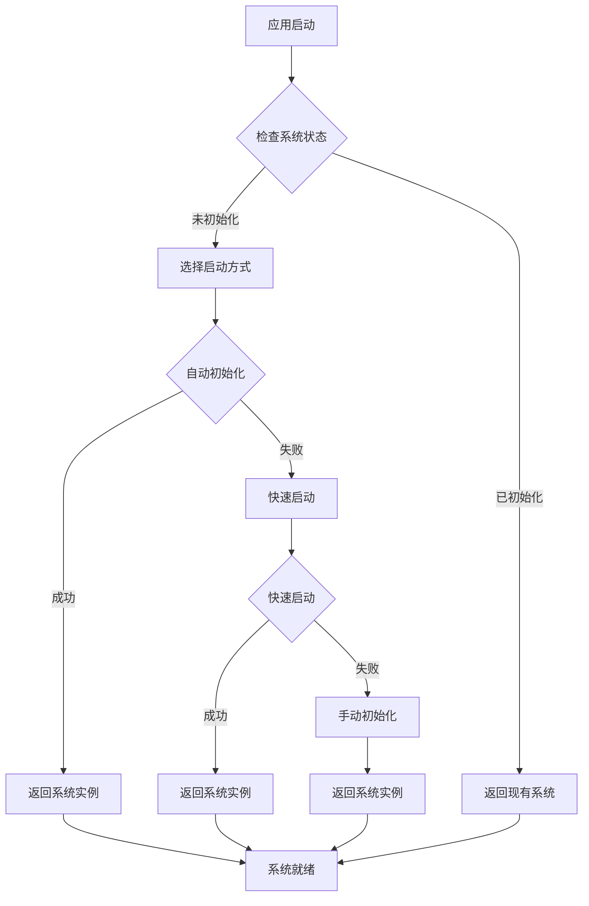
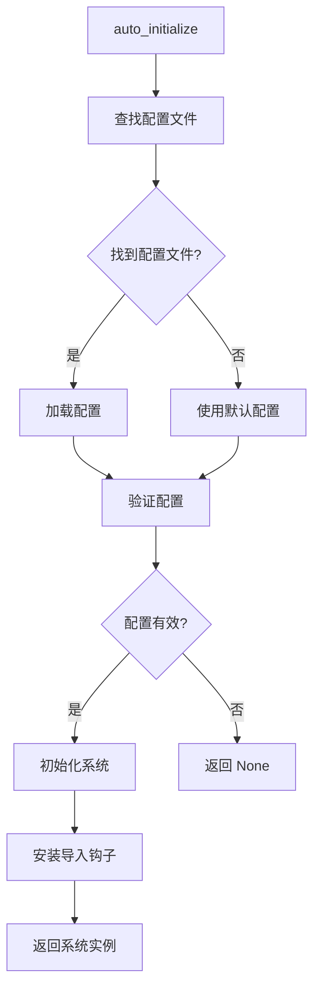
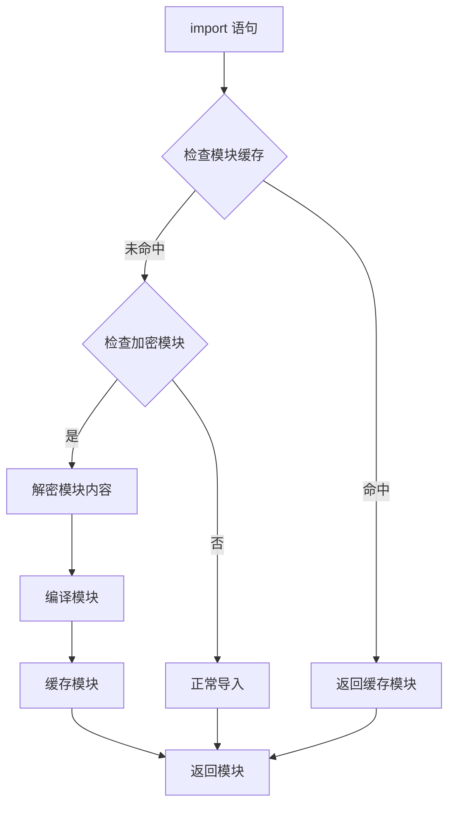
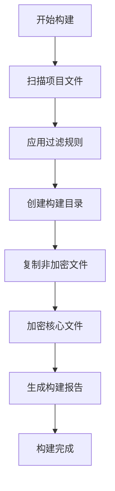

# 架构设计文档

## 🏗️ 系统架构概览

DeepEnc 框架采用分层架构设计，遵循 Linux 内核的设计理念：

```
┌─────────────────────────────────────────────────────────────┐
│                    应用层 (Application Layer)                │
├─────────────────────────────────────────────────────────────┤
│                    启动层 (Bootstrap Layer)                 │
│  ┌─────────────────┐  ┌─────────────────┐  ┌─────────────┐ │
│  │   auto_init     │  │  quick_start    │  │  bootstrap  │ │
│  └─────────────────┘  └─────────────────┘  └─────────────┘ │
├─────────────────────────────────────────────────────────────┤
│                    核心层 (Core Layer)                      │
│  ┌─────────────────┐  ┌─────────────────┐  ┌─────────────┐ │
│  │   加密引擎      │  │   授权管理      │  │   错误处理  │ │
│  │  AESCrypto      │  │  AuthManager    │  │   Errors    │ │
│  └─────────────────┘  └─────────────────┘  └─────────────┘ │
├─────────────────────────────────────────────────────────────┤
│                    服务层 (Service Layer)                   │
│  ┌─────────────────┐  ┌─────────────────┐  ┌─────────────┐ │
│  │   文件发现      │  │   智能加载      │  │   项目构建  │ │
│  │   Discovery     │  │    Loaders      │  │   Builders  │ │
│  └─────────────────┘  └─────────────────┘  └─────────────┘ │
├─────────────────────────────────────────────────────────────┤
│                    接口层 (Interface Layer)                 │
│  ┌─────────────────┐  ┌─────────────────┐  ┌─────────────┐ │
│  │   CLI 工具      │  │   Python API    │  │   配置管理  │ │
│  │   Commands      │  │   Functions     │  │     Config  │ │
│  └─────────────────┘  └─────────────────┘  └─────────────┘ │
└─────────────────────────────────────────────────────────────┘
```

## 🎯 设计原则

### 1. 简洁性 (Simplicity)
- **单一职责**: 每个组件只做一件事，做好一件事
- **最小接口**: 提供最少的必要接口
- **清晰边界**: 模块间边界明确，职责清晰

### 2. 透明性 (Transparency)
- **开发者无感知**: 加密/解密过程对开发者透明
- **错误可见**: 错误信息清晰明确，便于调试
- **状态可查**: 系统状态和运行信息可查询

### 3. 自动化 (Automation)
- **零配置**: 开箱即用，无需复杂配置
- **智能发现**: 自动发现项目结构和文件
- **自动降级**: 授权失败时自动降级到开发模式

### 4. 可靠性 (Reliability)
- **优雅降级**: 关键功能失败时提供替代方案
- **资源管理**: 自动管理内存、缓存等资源
- **错误恢复**: 从错误状态中自动恢复

### 5. 模块化 (Modularity)
- **松耦合**: 模块间依赖最小化
- **高内聚**: 相关功能集中在同一模块
- **易扩展**: 新功能易于添加和集成

## 🔧 核心组件

### 1. 系统启动器 (Bootstrap System)

系统启动器是框架的核心入口，提供多种启动方式：

```python
# 自动初始化 - 推荐用于开发环境
system = deepenc.auto_initialize()

# 快速启动 - 智能降级启动
system = deepenc.quick_start()

# 手动配置 - 精确控制启动过程
system = deepenc.initialize(module_config)

# 完整启动 - 包含所有初始化步骤
system = deepenc.bootstrap()
```

**设计特点:**
- **智能降级**: 自动选择最适合的启动方式
- **配置发现**: 自动查找和加载配置文件
- **状态管理**: 完整的系统生命周期管理

### 2. 加密引擎 (Encryption Engine)

基于 AES-CFB 模式的加密引擎，支持部分加密：

```python
class AESCrypto:
    def __init__(self):
        self.algorithm = "AES-CFB"
        self.key_length = 256
    
    def encrypt_file(self, input_path: str, output_path: str, key: bytes):
        """加密文件，支持部分加密"""
        pass
    
    def decrypt_file(self, input_path: str, key: bytes) -> bytes:
        """解密文件"""
        pass
```

**设计特点:**
- **部分加密**: 大文件只加密前 10MB，提升性能
- **流式处理**: 支持大文件的高效处理
- **密钥管理**: 支持多种密钥长度和算法

### 3. 授权管理 (Authorization Management)

统一的授权验证接口，支持硬件授权和许可证文件：

```python
class AuthManager:
    def __init__(self):
        self.hardware_auth = None
        self.encryption_key = None
    
    def _get_encryption_key(self):
        """获取加密密钥
        
        从许可证文件获取密钥，支持开发和生产两种模式。
        """
        # 从许可证文件获取
        key = self._get_key_from_license_file()
        if key:
            return key
        
        print("❌ 无法获取加密密钥")
        return None
```

**设计特点:**
- **多级授权**: 硬件授权 → 许可证文件
- **模式切换**: 支持开发和生产两种模式
- **安全降级**: 授权失败时优雅降级

### 4. 智能加载器 (Smart Loaders)

自动处理加密模块的导入和 ONNX 模型的加载：

```python
class ModuleLoaderManager:
    def __init__(self):
        self.loaders = {}
        self.import_hook = None
    
    def install_loader(self, module_config: Dict[str, str]):
        """安装模块加载器"""
        pass
    
    def load_module(self, module_name: str):
        """加载加密模块"""
        pass
```

**设计特点:**
- **透明导入**: 开发者无需修改导入语句
- **自动解密**: 导入时自动解密模块内容
- **缓存优化**: 解密内容智能缓存

## 🔄 核心工作流程

### 1. 系统启动流程



### 2. 自动初始化流程



### 3. 模块导入流程



## 🏗️ 构建系统

### 1. 项目构建器架构

```
ProjectBuilder
├── FileScanner          # 文件扫描器
│   ├── discover_python_files()    # 发现 Python 文件
│   ├── discover_onnx_files()      # 发现 ONNX 文件
│   └── discover_all_files()       # 发现所有文件
├── FileFilter          # 文件过滤器
│   ├── exclude_dirs    # 排除目录
│   ├── exclude_files   # 排除文件
│   └── include_files   # 包含文件
└── AESCrypto           # 加密引擎
    ├── encrypt_file()  # 加密文件
    └── decrypt_file()  # 解密文件
```

### 2. 构建流程



### 3. 文件过滤策略

```python
# 默认排除规则
DEFAULT_EXCLUDE_DIRS = [
    'tests', 'test', 'testing',
    'docs', 'documentation',
    '__pycache__', '.git',
    'build', 'dist', 'target'
]

DEFAULT_EXCLUDE_FILES = [
    '*.pyc', '*.pyo', '*.pyd',
    '*.log', '*.tmp',
    'setup.py', 'requirements.txt'
]

# 入口点保护
ENTRY_POINT_PROTECTION = [
    'src/grpc_main.py',  # 默认入口点
    'main.py',           # 自定义入口点
    'app.py'             # 应用入口点
]
```

## 🔐 安全设计

### 1. 密钥管理架构

```
密钥来源 (按优先级排序)
├── 硬件授权许可证 (生产环境)
│   ├── 设备 ID 绑定
│   ├── 硬件加密
│   └── 超时控制
├── 许可证文件 (开发/测试环境)
│   ├── 文件权限控制
│   ├── 路径安全
│   └── 内容验证
└── 降级机制
    ├── 开发模式
    ├── 错误提示
    └── 安全退出
```

### 2. 文件加密策略

```python
# 加密策略配置
ENCRYPTION_STRATEGY = {
    'algorithm': 'AES-CFB',
    'key_length': 256,
    'partial_encryption': True,
    'max_encrypt_size': 10 * 1024 * 1024,  # 10MB
    'iv_mode': 'fixed',
    'padding': 'PKCS7'
}

# 部分加密逻辑
def should_partial_encrypt(file_size: int) -> bool:
    """判断是否使用部分加密"""
    return (file_size > ENCRYPTION_STRATEGY['max_encrypt_size'] and 
            ENCRYPTION_STRATEGY['partial_encryption'])
```

### 3. 运行时安全

```python
# 运行时安全检查
class SecurityManager:
    def __init__(self):
        self.audit_log = []
        self.security_mode = False
    
    def check_file_access(self, file_path: str) -> bool:
        """检查文件访问权限"""
        pass
    
    def audit_operation(self, operation: str, details: dict):
        """审计操作日志"""
        pass
    
    def validate_license(self) -> bool:
        """验证许可证有效性"""
        pass
```

## 📊 性能优化

### 1. 缓存策略

```python
# 多级缓存架构
class CacheManager:
    def __init__(self):
        self.memory_cache = {}      # 内存缓存
        self.disk_cache = {}        # 磁盘缓存
        self.max_memory_size = 100 * 1024 * 1024  # 100MB
        self.max_disk_size = 500 * 1024 * 1024    # 500MB
    
    def get(self, key: str) -> Optional[bytes]:
        """获取缓存内容"""
        # 先查内存缓存
        if key in self.memory_cache:
            return self.memory_cache[key]
        
        # 再查磁盘缓存
        if key in self.disk_cache:
            content = self._load_from_disk(key)
            self._add_to_memory(key, content)
            return content
        
        return None
```

### 2. 内存管理

```python
# 智能内存管理
class MemoryManager:
    def __init__(self):
        self.memory_limit = 512 * 1024 * 1024  # 512MB
        self.current_usage = 0
        self.large_files = {}  # 大文件使用临时文件
    
    def allocate_memory(self, size: int) -> bool:
        """分配内存"""
        if self.current_usage + size > self.memory_limit:
            return False
        
        self.current_usage += size
        return True
    
    def use_temp_file(self, file_path: str, size: int):
        """使用临时文件处理大文件"""
        if size > 10 * 1024 * 1024:  # 10MB
            self.large_files[file_path] = self._create_temp_file()
```

### 3. 并发处理

```python
# 并发解密处理
import concurrent.futures
from typing import List, Tuple

class ConcurrentProcessor:
    def __init__(self, max_workers: int = 4):
        self.max_workers = max_workers
        self.executor = concurrent.futures.ThreadPoolExecutor(max_workers=max_workers)
    
    def process_files(self, files: List[Tuple[str, str]]) -> List[bool]:
        """并发处理多个文件"""
        futures = []
        
        for input_path, output_path in files:
            future = self.executor.submit(self._process_single_file, input_path, output_path)
            futures.append(future)
        
        results = []
        for future in concurrent.futures.as_completed(futures):
            try:
                result = future.result()
                results.append(result)
            except Exception as e:
                results.append(False)
        
        return results
```

## 🔌 扩展性设计

### 1. 插件架构

```python
# 插件管理器
class PluginManager:
    def __init__(self):
        self.plugins = {}
        self.hooks = {}
    
    def register_plugin(self, name: str, plugin: object):
        """注册插件"""
        self.plugins[name] = plugin
    
    def register_hook(self, hook_name: str, callback: callable):
        """注册钩子函数"""
        if hook_name not in self.hooks:
            self.hooks[hook_name] = []
        self.hooks[hook_name].append(callback)
    
    def call_hook(self, hook_name: str, *args, **kwargs):
        """调用钩子函数"""
        if hook_name in self.hooks:
            for callback in self.hooks[hook_name]:
                callback(*args, **kwargs)
```

### 2. 自定义过滤器

```python
# 自定义文件过滤器
class CustomFileFilter(FileFilter):
    def __init__(self, custom_rules: dict):
        super().__init__(custom_rules)
        self.custom_patterns = custom_rules.get('custom_patterns', [])
    
    def should_include(self, file_path: Path) -> bool:
        """自定义包含逻辑"""
        # 调用父类逻辑
        if not super().should_include(file_path):
            return False
        
        # 应用自定义规则
        for pattern in self.custom_patterns:
            if self._match_pattern(file_path, pattern):
                return True
        
        return False
```

### 3. 配置扩展

```python
# 配置扩展机制
class ConfigExtension:
    def __init__(self, base_config: dict):
        self.base_config = base_config
        self.extensions = {}
    
    def add_extension(self, name: str, config: dict):
        """添加配置扩展"""
        self.extensions[name] = config
    
    def get_merged_config(self) -> dict:
        """获取合并后的配置"""
        merged = self.base_config.copy()
        
        for ext_name, ext_config in self.extensions.items():
            merged = self._deep_merge(merged, ext_config)
        
        return merged
```

## 🚀 部署架构

### 1. 容器化部署

```dockerfile
# 多阶段构建
FROM python:3.9-slim as builder

# 构建阶段
WORKDIR /build
COPY requirements.txt .
RUN pip install --no-cache-dir -r requirements.txt

COPY . .
RUN python -m deepenc build

# 运行阶段
FROM python:3.9-slim

WORKDIR /app
COPY --from=builder /build/build/ .

# 设置环境变量
ENV AUTH_MODE=PROD

# 创建非 root 用户
RUN useradd --create-home --shell /bin/bash app \
    && chown -R app:app /app
USER app

# 健康检查
HEALTHCHECK --interval=30s --timeout=10s --start-period=5s --retries=3 \
    CMD python -c "import deepenc; print('OK')" || exit 1

CMD ["python", "main.py"]
```

### 2. Kubernetes 部署

```yaml
# 部署配置
apiVersion: apps/v1
kind: Deployment
metadata:
  name: deepenc-app
spec:
  replicas: 3
  selector:
    matchLabels:
      app: deepenc-app
  template:
    spec:
      containers:
      - name: deepenc-app
        image: your-registry/deepenc-app:latest
        env:
        - name: AUTH_MODE
          value: "PROD"
        - name: LICENSE_PATH
          value: "/data/appdatas/inference/license.dat"
        resources:
          requests:
            memory: "512Mi"
            cpu: "250m"
          limits:
            memory: "1Gi"
            cpu: "500m"
        volumeMounts:
        - name: license-volume
          mountPath: /data/appdatas/inference
          readOnly: true
      volumes:
      - name: license-volume
        secret:
          secretName: deepenc-license
---
# 许可证密钥
apiVersion: v1
kind: Secret
metadata:
  name: deepenc-license
type: Opaque
data:
  license.dat: <base64-encoded-license>
```

### 3. 云原生特性

```python
# 云原生配置管理
class CloudNativeConfig:
    def __init__(self):
        self.config_map = None
        self.secrets = None
    
    def load_from_k8s(self):
        """从 Kubernetes 加载配置"""
        try:
            # 加载 ConfigMap
            config_path = "/etc/deepenc/config"
            if os.path.exists(config_path):
                self.config_map = self._load_config_map(config_path)
            
            # 加载 Secrets
            secrets_path = "/etc/deepenc/secrets"
            if os.path.exists(secrets_path):
                self.secrets = self._load_secrets(secrets_path)
                
        except Exception as e:
            logging.warning(f"无法从 Kubernetes 加载配置: {e}")
    
    def get_config_value(self, key: str, default=None):
        """获取配置值"""
        # 优先级: Secrets > ConfigMap > 环境变量 > 默认值
        if self.secrets and key in self.secrets:
            return self.secrets[key]
        
        if self.config_map and key in self.config_map:
            return self.config_map[key]
        
        return os.environ.get(key, default)
```

## 📊 监控和调试

### 1. 系统监控

```python
# 系统监控器
class SystemMonitor:
    def __init__(self):
        self.metrics = {}
        self.start_time = time.time()
    
    def collect_metrics(self):
        """收集系统指标"""
        import psutil
        
        process = psutil.Process()
        memory_info = process.memory_info()
        
        self.metrics.update({
            'uptime': time.time() - self.start_time,
            'memory_usage': memory_info.rss,
            'cpu_percent': process.cpu_percent(),
            'open_files': len(process.open_files()),
            'threads': process.num_threads()
        })
        
        return self.metrics
    
    def get_health_status(self) -> dict:
        """获取健康状态"""
        metrics = self.collect_metrics()
        
        # 健康检查逻辑
        health_status = {
            'status': 'healthy',
            'checks': {
                'memory': metrics['memory_usage'] < 500 * 1024 * 1024,  # 500MB
                'cpu': metrics['cpu_percent'] < 80,
                'files': metrics['open_files'] < 1000
            }
        }
        
        # 如果有任何检查失败，标记为不健康
        if not all(health_status['checks'].values()):
            health_status['status'] = 'unhealthy'
        
        return health_status
```

### 2. 调试工具

```python
# 调试管理器
class DebugManager:
    def __init__(self):
        self.debug_mode = os.environ.get('DEEPENC_DEBUG', '0') == '1'
        self.log_level = logging.DEBUG if self.debug_mode else logging.INFO
    
    def enable_debug_logging(self):
        """启用调试日志"""
        logging.basicConfig(
            level=self.log_level,
            format='%(asctime)s - %(name)s - %(levelname)s - %(message)s'
        )
    
    def debug_info(self, message: str, **kwargs):
        """调试信息"""
        if self.debug_mode:
            print(f"[DEBUG] {message}")
            for key, value in kwargs.items():
                print(f"  {key}: {value}")
    
    def trace_function_call(self, func_name: str, args: tuple, kwargs: dict):
        """跟踪函数调用"""
        if self.debug_mode:
            print(f"[TRACE] 调用函数: {func_name}")
            print(f"  参数: {args}")
            print(f"  关键字参数: {kwargs}")
```

### 3. 性能分析

```python
# 性能分析器
import cProfile
import pstats
from functools import wraps

class PerformanceProfiler:
    def __init__(self):
        self.profiler = cProfile.Profile()
        self.stats = None
    
    def profile_function(self, func):
        """函数性能分析装饰器"""
        @wraps(func)
        def wrapper(*args, **kwargs):
            self.profiler.enable()
            try:
                result = func(*args, **kwargs)
                return result
            finally:
                self.profiler.disable()
                self.stats = pstats.Stats(self.profiler)
        
        return wrapper
    
    def get_stats(self) -> pstats.Stats:
        """获取性能统计"""
        if self.stats:
            return self.stats
        return None
    
    def print_stats(self, sort_by='cumulative', limit=10):
        """打印性能统计"""
        if self.stats:
            self.stats.sort_stats(sort_by)
            self.stats.print_stats(limit)
```

## 🔮 未来规划

### 1. 短期目标 (1-3 个月)

- **性能优化**: 提升解密性能 20%
- **缓存优化**: 实现智能缓存策略
- **错误处理**: 提供更友好的错误信息

### 2. 中期目标 (3-6 个月)

- **分布式支持**: 支持 Redis 等分布式缓存
- **云原生**: 完善 Kubernetes 支持
- **配置管理**: 支持配置热更新

### 3. 长期目标 (6-12 个月)

- **AI 增强**: 智能配置推荐
- **多语言支持**: 支持 Java、Go 等
- **生态系统**: 构建完整的工具链

### 4. 技术演进


## 📚 总结

DeepEnc 框架采用分层架构设计，遵循 Linux 内核的设计理念：

- **简洁性**: 每个组件职责单一，接口清晰
- **透明性**: 开发者无感知的加密/解密过程
- **自动化**: 零配置，智能发现和降级
- **可靠性**: 优雅的错误处理和资源管理
- **模块化**: 松耦合，高内聚，易于扩展

通过这种架构设计，框架能够：
1. **简化开发**: 开发者无需关心加密细节
2. **提升性能**: 智能缓存和并发处理
3. **确保安全**: 多级授权和运行时保护
4. **便于部署**: 支持容器化和云原生
5. **易于维护**: 清晰的模块边界和错误处理

这种设计使得 DeepEnc 框架既适合快速原型开发，也能满足企业级生产环境的需求。
